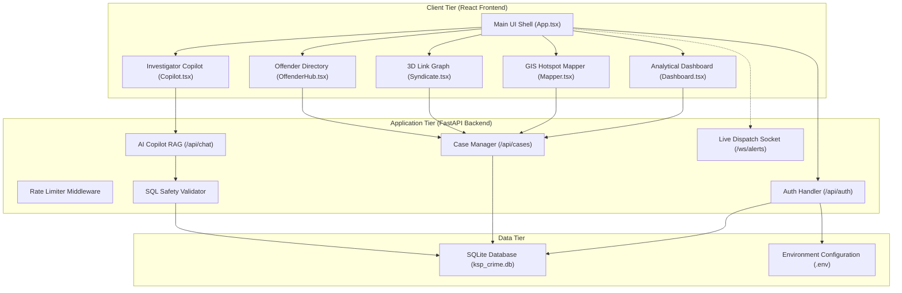
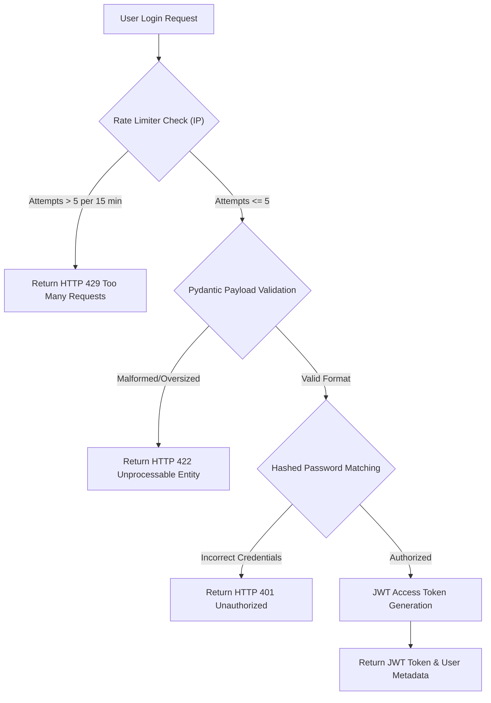
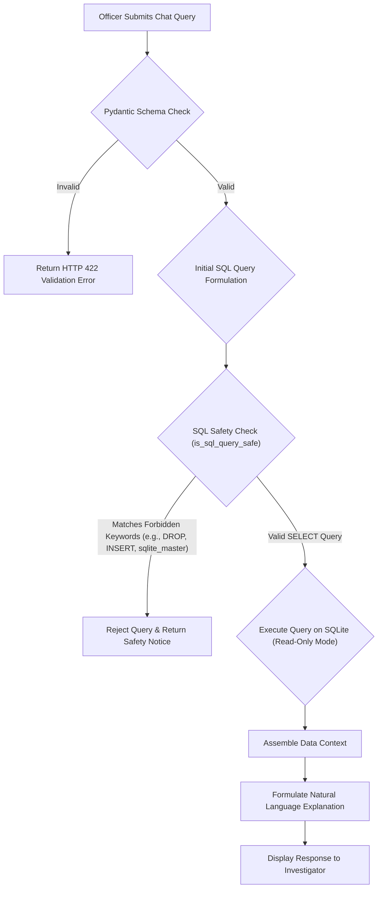

# Karnataka State Police CrimePilot Command Hub

The Karnataka State Police (KSP) CrimePilot Command Hub is a web-based portal developed for the State Crime Record Bureau (SCRB). The system provides state investigators, analysts, and policymakers with real-time geospatial crime mapping, 3D syndicate correlation graphs, interactive AI copilot querying, and offender risk analysis.

The platform is designed to run securely locally and is engineered for production deployment on the Zoho Catalyst cloud ecosystem.

---

## Technical Stack

The application is built using a modern, decoupled web architecture:

### Frontend
- **Framework**: React 19 (TypeScript) with Vite Build Engine
  - Badge: 
- **Styling**: Tailwind CSS
  - Badge: 
- **3D Visualization**: React Three Fiber (Three.js Wrapper)
  - Badge: 
- **Geospatial Mapping**: React Leaflet (OpenStreetMap API)
  - Badge: 
- **Icons**: Lucide React
  - Badge: 

### Backend
- **Framework**: FastAPI (Python 3.10+)
  - Badge: 
- **Environment**: Python
  - Badge: 
- **Data Validation**: Pydantic
  - Badge: 
- **Cryptography**: Passlib (PBKDF2-SHA256 Hashing)
  - Badge: 

### Database and Infrastructure
- **Database**: SQLite (Relational Data Store)
  - Badge: 
- **Hosting**: Zoho Catalyst AppSail (Serverless Python Node Environment)
  - Badge: 

---

## Core Features

1. **Analytical Command Dashboard**: Aggregates state-wide statistics, live incident timelines, and crime head distributions. Supports generating and exporting formal FIR dossier PDF sheets.
2. **Crime Mapper (GIS)**: Renders coordinates using Leaflet tiles, highlighting active spatiotemporal hotspot buffers and clusters based on customizable category filters.
3. **Syndicate Link (3D Node Graph)**: Renders interactive WebGL-based relationship systems mapping transactions, communication connections, and accomplice hierarchies between criminal offenders and bank nodes.
4. **Investigator Copilot**: A secure Retrieval-Augmented Generation (RAG) assistant allowing officers to submit natural language inquiries in both English and Kannada to extract database entities.
5. **Offender Hub**: Tracks historical case records, heinous offense volumes, and computes dynamic threat/recidivism scores.

---

## System Architecture

The following diagram illustrates the decoupled tier structure, detailing how the React frontend interacts with the FastAPI backend endpoints, safety layers, and database.



---

## Logical Data Flows

### 1. User Authentication and Session Management

This flowchart maps the security sequence executed when an officer logs into the portal:



### 2. Copilot Query RAG Execution and SQL Safety Checks

This flowchart illustrates the safety validation pipeline applied to natural language prompts translating to SQL statements:



---

## Screen Captures

Below are visual captures of the application pages located inside the repository:

### 1. Landing Page
Platform entry point showing features and information panels for officers.


### 2. Officer Authentication and Sign In
Secure authentication screen for official investigator accounts.


### 3. Command Hub Dashboard
Analytical overview displaying real-time metrics, recent cases list, and registration actions.


### 4. Investigator AI Copilot
Natural language inquiry interface accepting structured database queries.


### 5. GIS Spatiotemporal Crime Mapper
Geospatial interactive mapping workspace displaying cluster groups and heat zones.


### 6. Syndicate Link and Offender Hub
Crime correlation workspace mapping connected criminal accomplices and threat levels.


---

## Setup and Local Development Guide

### Prerequisites
- Python 3.10+
- Node.js (version 18 or higher)
- npm or yarn package manager

### 1. Backend Service Configuration
1. Navigate to the backend directory:
   ```bash
   cd backend
   ```
2. Create a virtual environment and activate it:
   ```bash
   python -m venv venv
   # On Windows:
   venv\Scripts\activate
   # On macOS/Linux:
   source venv/bin/activate
   ```
3. Install the required dependencies:
   ```bash
   pip install -r requirements.txt
   ```
4. Create your local environmental configuration file:
   ```bash
   cp .env.example .env
   ```
5. Edit `.env` to supply your private configurations (such as your `GEMINI_API_KEY`).
6. Start the FastAPI server:
   ```bash
   uvicorn main:app --host 127.0.0.1 --port 8000 --reload
   ```

### 2. Frontend Development Server
1. Open a new terminal and navigate to the frontend directory:
   ```bash
   cd frontend
   ```
2. Install npm dependencies:
   ```bash
   npm install
   ```
3. Launch the local development dev server:
   ```bash
   npm run dev
   ```
4. Open your browser and navigate to the local address displayed in the terminal output (typically `http://localhost:5173`).

---

## Deployment Guide (Zoho Catalyst AppSail)

The application is structured to be packaged and deployed directly to Zoho Catalyst AppSail.

### Preparation and Build
Before triggering deployment, the frontend source files must be compiled and embedded inside the backend server structure so they can be hosted statically by the FastAPI production node:

1. Navigate to the frontend workspace:
   ```bash
   cd frontend
   ```
2. Build the optimized production bundle:
   ```bash
   npm run build
   ```
3. Copy the compiled assets from `frontend/dist/` into the `backend/frontend/dist/` folder:
   ```bash
   # On Windows (PowerShell):
   Copy-Item -Path "dist/*" -Destination "../backend/frontend/dist" -Recurse -Force
   
   # On macOS/Linux:
   cp -r dist/* ../backend/frontend/dist/
   ```

### Deploying via CLI
1. Ensure the Zoho Catalyst CLI is installed globally:
   ```bash
   npm install -g zcatalyst-cli
   ```
2. Authenticate the CLI with your Zoho account:
   ```bash
   catalyst login
   ```
3. Run the deployment command from the project root workspace directory, passing your active Project ID:
   ```bash
   catalyst deploy -p 48893000000013024
   ```
4. Once completed successfully, the CLI will output your live public AppSail URL.

---

## Production Security Measures

- **Rate Limiting**: Integrated middleware tracks client IPs to enforce a maximum of 5 auth attempts per 15 minutes on `/api/auth/login` and 100 requests per minute elsewhere.
- **SQL Sanitization**: Intercepts generated prompts to block schema extraction keywords, forcing read-only SQLite executions.
- **Payload Boundaries**: All route payloads are validated via Pydantic model limits, and strings are HTML-escaped to protect against Cross-Site Scripting (XSS).
- **Credential Hashing**: User passwords are encrypted on application start using PBKDF2-SHA256 contexts, preventing plaintext matching in memory.