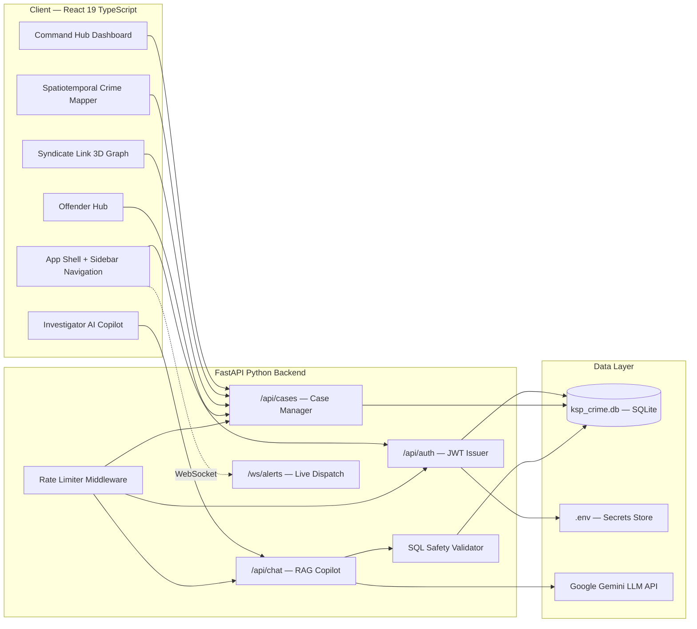
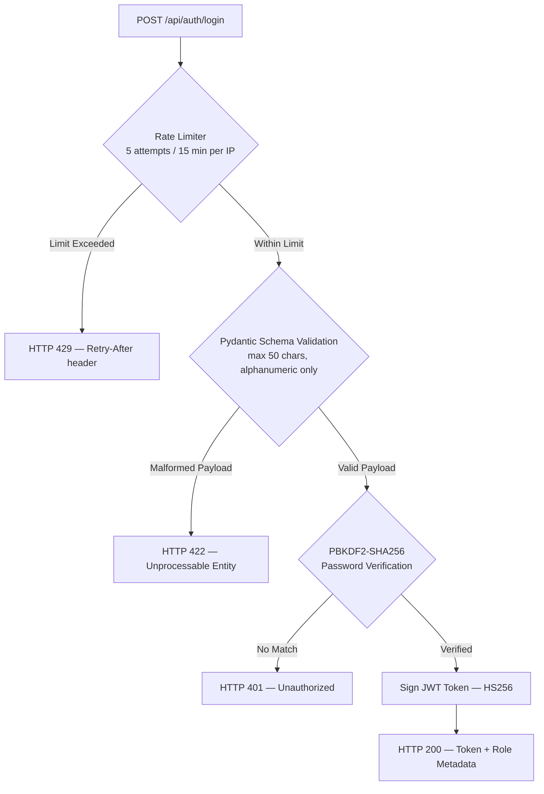
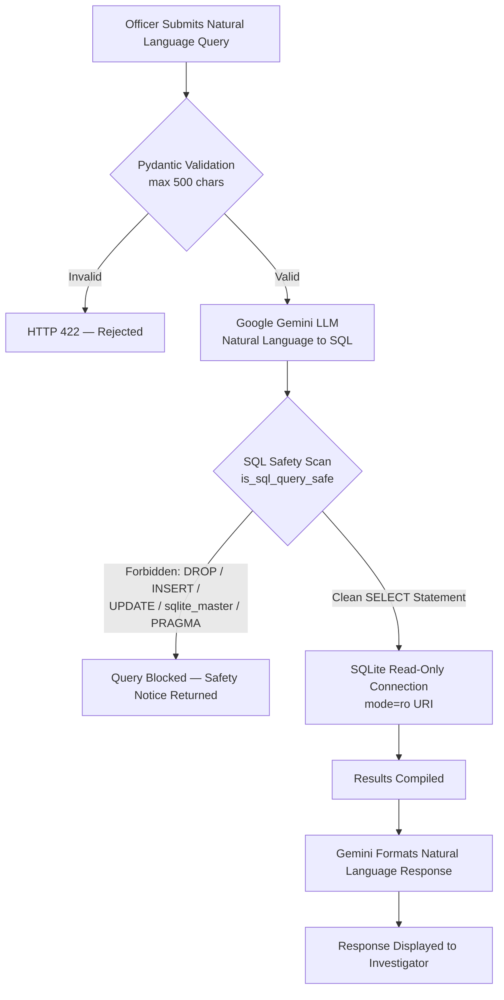

<div align="center">

# KSP CrimePilot — Command Hub

**A state-level intelligence platform for the Karnataka State Police SCRB**

Real-time geospatial crime mapping, 3D syndicate correlation graphs,
AI-powered investigator queries, and offender threat analytics — unified under one secure command interface.

<br/>

[](https://ksp-crimepilot-50044361086.development.catalystappsail.in)


</div>

---

## Table of Contents

- [Overview](#overview)
- [Technology Stack](#technology-stack)
- [Platform Modules](#platform-modules)
- [System Architecture](#system-architecture)
- [Security Architecture](#security-architecture)
- [Screen Captures](#screen-captures)
- [Local Development](#local-development)
- [Production Deployment](#production-deployment)
- [Security Implementation](#security-implementation)

---

## Overview

The KSP CrimePilot Command Hub is a web-based intelligence portal built for the **State Crime Record Bureau (SCRB)** of Karnataka. It consolidates fragmented investigative workflows into a single secure, role-gated interface accessible to Investigators, Station House Officers, and District Superintendents.

The platform is engineered on a decoupled architecture — a React 19 TypeScript frontend served as a static bundle through a hardened FastAPI Python backend, deployed to the Zoho Catalyst AppSail serverless runtime.

| Attribute         | Detail                                              |
|-------------------|-----------------------------------------------------|
| Target Users      | KSP Investigators, SHOs, District SPs, Analysts    |
| Authentication    | JWT Bearer tokens with PBKDF2-SHA256 hashed credentials |
| Database          | SQLite (read-only AI access mode)                  |
| Deployment Target | Zoho Catalyst AppSail — Python Serverless           |
| Responsiveness    | Fully responsive across mobile, tablet, and desktop |

---

## Technology Stack

### Frontend

| Technology | Role |
|---|---|
|  | UI framework with TypeScript |
|  | Build engine and dev server |
|  | Utility-first styling system |
|  | WebGL 3D visualization via React Three Fiber |
|  | Geospatial tile rendering via React Leaflet |
|  | Static typing across the full frontend |
|  | Icon library |

### Backend

| Technology | Role |
|---|---|
|  | High-performance async REST API framework |
|  | Server-side runtime |
|  | Request payload validation and schema enforcement |
|  | Embedded relational database |
|  | Session tokens for role-based access control |
|  | LLM for natural language to SQL translation |

### Infrastructure

| Technology | Role |
|---|---|
|  | AppSail serverless Python hosting |
|  | Source control and CI/CD pipeline |

---

## Platform Modules

| Module | Description | Access Level |
|---|---|---|
| **Command Hub Dashboard** | Real-time statistics, FIR timelines, district crime distribution, case registration, and PDF export | Investigator, SHO, SP |
| **Investigator AI Copilot** | RAG-powered natural language query engine supporting English and Kannada inputs | All roles |
| **Spatiotemporal Crime Mapper** | Leaflet-based GIS interface with hotspot radius buffers, category filters, and year slider | All roles |
| **Syndicate Link Graph** | Interactive 3D WebGL node network visualizing offender-account-crime relationships | SHO, SP only |
| **Offender Hub** | Threat scoring engine with recidivism risk analysis and accomplice linkage tracking | All roles |

---

## System Architecture



---

## Security Architecture

### Authentication Flow



### AI Copilot Safety Pipeline



---

## Screen Captures

### Landing Page

<table>
  <tr>
    <td></td>
    <td></td>
  </tr>
</table>

---

### Command Hub Dashboard

The central analytics workspace. Displays total registered FIRs, active investigation counts, resolution rates, and tracked financial trails. Officers with Investigator or SHO clearance can register new cases and export official FIR PDFs directly from this panel.


---

### Investigator AI Copilot

A Retrieval-Augmented Generation interface backed by the Google Gemini LLM. Accepts queries in both English and Kannada, translates them to parameterized SQL, runs them against a read-only database connection, and returns structured natural language responses. All generated queries pass through the `is_sql_query_safe` validator before execution.


---

### Spatiotemporal Crime Mapper

An interactive Leaflet.js map rendering all case coordinates as classified markers. Supports district and crime category filtering, a temporal year-range slider, and toggleable hotspot radius buffers that visually surface high-density crime clusters.


---

### Syndicate Link — 3D Relationship Graph

A Three.js WebGL canvas rendering the full criminal network as an interactive node graph. Nodes represent accused persons, bank accounts, and case entities. Edges map transaction trails and accomplice relationships. Officers can orbit, zoom, and click-select individual nodes to inspect their profile and connections. Access is restricted to SHO clearance and above.


---

### Offender Hub

A searchable directory of all tracked offenders with dynamically computed threat scores, recidivism risk classifications (Moderate / High / Critical), heinous offense counts, and accomplice linkage statistics. Selecting an offender renders their full threat profile alongside historical case participation charts.


---

## Local Development

### Prerequisites

- Python 3.10 or higher
- Node.js 18 or higher
- npm

### Backend

```bash
# Navigate to the backend directory
cd backend

# Create and activate a virtual environment
python -m venv venv

# Windows
venv\Scripts\activate
# macOS / Linux
source venv/bin/activate

# Install dependencies
pip install -r requirements.txt

# Configure environment variables
cp .env.example .env
# Open .env and add your GEMINI_API_KEY and JWT_SECRET_KEY

# Start the development server
uvicorn main:app --host 127.0.0.1 --port 8000 --reload
```

### Frontend

```bash
# In a separate terminal, navigate to the frontend directory
cd frontend

# Install npm dependencies
npm install

# Start the Vite development server
npm run dev

# Open http://localhost:5173 in your browser
```

### Environment Variables Reference

| Variable | Description | Required |
|---|---|---|
| `GEMINI_API_KEY` | Google Gemini API key for the AI Copilot | Yes |
| `JWT_SECRET_KEY` | Secret key for signing JWT access tokens | Yes |
| `ADMIN_PASSWORD` | Hashed password for admin-level accounts | Yes |
| `CORS_ALLOWED_ORIGINS` | Comma-separated list of allowed frontend origins | Yes |

---

## Production Deployment

### Build and Sync

```bash
# Step 1 — Build the production bundle
cd frontend
npm run build

# Step 2 — Copy compiled assets into the backend static serving directory
# Windows (PowerShell)
Copy-Item -Path "dist/*" -Destination "../backend/frontend/dist" -Recurse -Force

# macOS / Linux
cp -r dist/* ../backend/frontend/dist/
```

### Deploy to Zoho Catalyst AppSail

```bash
# Install the Catalyst CLI globally if not already installed
npm install -g zcatalyst-cli

# Authenticate with your Zoho account
catalyst login

# Deploy to your project (replace with your Project ID)
catalyst deploy -p 48893000000013024
```

The CLI will output your live AppSail URL upon successful deployment.

---

## Security Implementation

| Layer | Mechanism | Detail |
|---|---|---|
| **Rate Limiting** | Custom Starlette middleware | Max 5 auth attempts per 15 minutes per IP; 100 requests per minute on all other routes |
| **Input Validation** | Pydantic v2 schema models | Max field lengths, alphanumeric character constraints, HTML escape on all string inputs |
| **Password Security** | PBKDF2-SHA256 via Passlib | Passwords hashed on server startup; never compared in plaintext |
| **SQL Injection** | `is_sql_query_safe` validator | Blocks DROP, INSERT, UPDATE, DELETE, PRAGMA, sqlite_master, and nested statements |
| **Database Access** | Read-only URI mode | AI-generated queries execute against `mode=ro` SQLite connections only |
| **Session Tokens** | JWT HS256 signed tokens | Role embedded in payload; verified on every protected route |
| **XSS Protection** | `html.escape()` on all inputs | Applied server-side before any string is persisted or reflected |
| **Secret Management** | `.env` file excluded from Git | Credentials never committed; `.env.example` provided as a safe template |